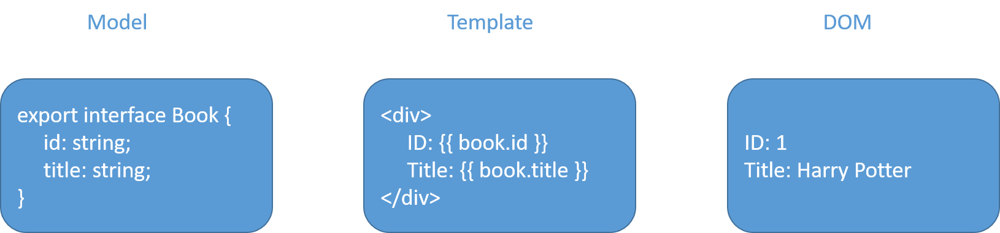
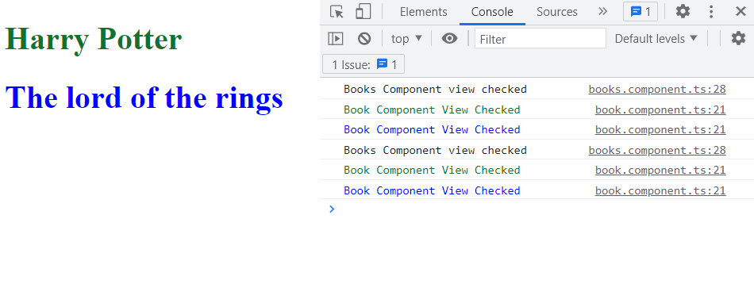
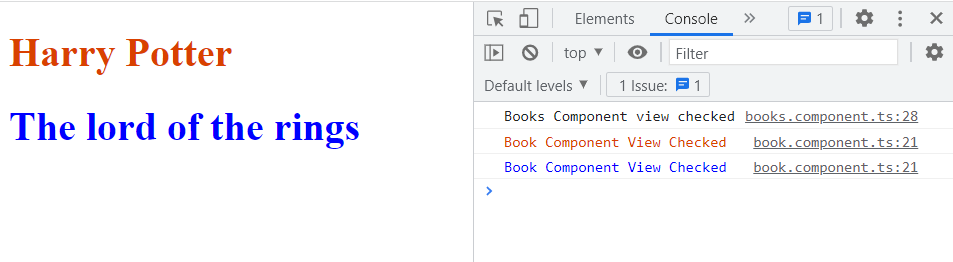
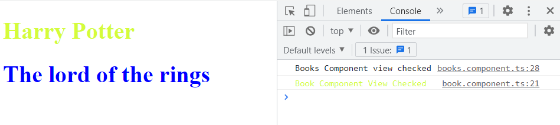

# What is Change Detection

Angular framework needs to replicate the state of our application on the UI by combining the state and the template:



Whenever a change happens in the state, the view needs to be updated. This action of syncing the HTML with the state data is called Change Detection.

Most of the time, we do not need to care about this mechanism, until we need to optimize the performance of our application. Change detection is a big topic regarding performance issues in large applications.

# How Change Detection works

A change detection cycle can be split into two main parts:

- Developer updates the application model
- Angular syncs the updated model in the view by re-rendering it:
	- detects the change
	- checks every component in the component tree from top to bottom
	- updates the view

When a property changes, the detector compares the current value with the previous value of the property, performing a simple === comparison.

Change Detection does not perform a deep object comparison, it only compares the previous and current value of properties used by the template.

# Default strategy and performance

By default, Angular Change Detection checks for all components from top to bottom if a template value has changed. This is performed every time an event triggers changes (user event, timer, XHR, ...).

Although Angular does a lot of optimizations behind the scenes, the performance can still drop on larger applications.

In those cases, we need to handle the detection strategy.

# Change detection strategies

Angular provides two strategies to run change detections:

- Default
- OnPush

OnPush strategy can be set in component decorator metadata like so:

```typescript
@Component({
  selector: 'app-example-component',
  templateUrl: './example-component.component.html',
  styleUrls: ['./example-component.component.scss'],
  changeDetection: ChangeDetectionStrategy.OnPush // overriding .Default strategy
})
```

Using this strategy, Angular knows that the component only needs to be updated if:

- the input reference has changed (@Input)
- the component or one of its children triggers an event handler (@Output)
- change detection is triggered manually
- an observable linked to the template via the async pipe emits a new value

## Input reference changes

In the default change detection strategy, Angular will run the change detector any time @Input() data is changed or modified. Using the OnPush strategy, the change detector is only triggered if a new reference is passed as @Input() value.

## Event handler is triggered

When a child component emits an event (using @Ouput), change detection is triggered.

## Manual change detection

ChangeDetectorRef class provides two methods for running change detection manually:
- detectChanges(): runs change detection on this view and its children
- markForCheck(): does not trigger change detection but marks all OnPush ancestors as to be checked once, either as part of the current or next change detection cycle. It will run change detection on marked components even though they are using the OnPush strategy.

The code below shows how to use it in a component: 

```typescript
constructor(private readonly cdr: ChangeDetectorRef) {} // provide ChangeDetectorRef in the component constructor

public updateTitle(newTitle: string): void {
	this.title = newTitle;
	this.cdr.detectChanges(); // manual change detection
}
```

## Async pipe

The built-in AsyncPipe subscribes to an observable and returns the latest value it has emitted.

Internally the AsyncPipe calls markForCheck each time a new value is emitted.

It is recommended to use it as much as possible to easier perform a later switch from default change detection strategy to OnPush.

# Example

We are going to build a `BooksComponent`, that will have a list of books to display. For that, a child `BookComponent` will take a `book` as Input and will display the book title with its own color. A click event will be fired as an Output to the parent `BooksComponent`.

A `check()` method will be called in the parent component, to see when the `BooksComponent` view is checked.

## BooksComponent

```typescript
import { Component, OnInit } from '@angular/core';

export interface Book {
id: string;
title: string;
color: string;
}

@Component({
selector: 'app-books',
template: `
	<app-book *ngFor="let book of books;"
		[book]="book"
		(clicked)="onBookClicked()">
	</app-book>

	{{ check() }}
`,
})
export class BooksComponent implements OnInit {

	public books: Book[] = [
		{ id: '1', title: 'Harry Potter', color: 'red' },
		{ id: '2', title: 'The lord of the rings', color: 'blue' }
	];

	constructor() { }

	ngOnInit(): void {
	}

	check() {
		console.log('Books Component view checked');
	}

	public onBookClicked(): void {
		this.books[0].color = this.randomColor(); // mutating the object
	}

	private randomColor(): string {
		return `#${Math.floor(Math.random()*16777215).toString(16)}`;
	}
}
```

## BookComponent
```typescript
import { Component, EventEmitter, Input, OnInit, Output } from '@angular/core';
import { Book } from '../books/books.component';

@Component({
selector: 'app-book',
template: `
	<h1 [style.color]="getColor()" (click)="onClick()">
		{{book.title}}
	</h1>
`
})
export class BookComponent implements OnInit {

	@Input() book: Book;
	@Output() clicked: EventEmitter<string> = new EventEmitter();

	constructor() { }

	ngOnInit(): void {
	}

	getColor(): string {
		console.log('%cBook Component View Checked', `color: ${this.book.color}`); // will log on view checked
		return this.book.color;
	}

	onClick(): void {
		this.clicked.emit(this.book.id);
	}
}
```

After clicking on a book we get: 



Both `BooksComponent` and `BookComponent` have been checked twice, even though only one book has been updated.

Now, let's implement the `OnPush` strategy on `BooksComponent`.

```typescript
@Component({
selector: 'app-books',
template: `
	<app-book *ngFor="let book of books;"
		[book]="book"
		(clicked)="onBookClicked()">
	</app-book>

	{{ check() }}
`,
changeDetectionStrategy: ChangeDetectionStrategy.OnPush // New line
})
export class BooksComponent implements OnInit {
(...)
```

Let's click again on a book:



Now `BooksComponent` and `BookComponent` have been checked only once. 

But we know that only one instance of `BookComponent` needs to be updated, as only the first book color is updated. So we have to implement the `OnPush` strategy on `BookComponent`.

```typescript
@Component({
selector: 'app-book',
templateUrl: './book.component.html',
styleUrls: ['./book.component.scss'],
changeDetection: ChangeDetectionStrategy.OnPush // New line
})
export class BookComponent implements OnInit {
(...)
```

And now we get: 


Only the first book view has been checked.

You may wonder why it has been checked, as the Input reference did not change (book object has been mutated). This is in fact because the component triggered an Output (`clicked`).

Now we are going to write code that won't work (but don't worry, in the end it will!).

We add a button in `BooksComponent` to change the color of the second book.

```html
<button pButton label="Change Second Book Color" class="p-button" (click)="changeSecondBookColor()"></button>
```
```typescript
public changeSecondBookColor(): void {
	this.books[1].color = this.randomColor(); // mutating the object books[1]
}
```

If we click on this new button, nothing changes. This is because we `mutate` the book object, without creating a new reference, and `OnPush` strategy at `BookComponent` level is not triggered in that case.

We must provide a new reference for the book Input if we want the change detection to be happening.

```typescript
public changeSecondBookColor(): void {
	this.books[1] = { ...this.books[1], color: this.randomColor() }; // creating a new reference
}
```

And now it is working! :)