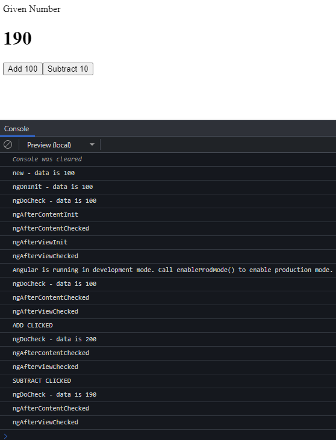

A component instance has a lifecycle that starts when Angular instantiates the component class and renders the component view along with its child views. The lifecycle continues with change detection, as Angular checks to see when data-bound properties change, and updates both the view and the component instance as needed.

For controlling the components within Angular, the developers can use the hook events at different phases of the application. Eight types of lifecycle hook events are present which the developers can use in any of the components of the angular. The function call corresponding to the specific lifecycle event has to be added by the developer. 

## Lifecycle hooks
After instanting a component or directive by calling its **constructor**, Angular calls the hook methods you have implemented at the appropriate point in the lifecycle of that instance.

Angular executes hook methods in the following sequence. Use them to perform the following kinds of operations.

### ngOnChanges
**ngOnChanges** triggers following the modification of **@Input** bound class members. Data bound by the **@Input()** decorator come from an external source. When the external source alters that data in a detectable manner, it passes through the **@Input** property again.

With this update, **ngOnChanges** immediately fires. It also fires upon initialization of input data. The hook receives one optional parameter of type **SimpleChanges**. This value contains information on the changed input-bound properties.

### ngOnInit
This event initializes after angular first displays the data-bound properties or when the component has been initialized. This event basically is called only once just after the **ngOnChanges** events. This event is mainly used for initializing data in a component.

### ngDoCheck
This event is triggered every time when the input properties of a component are checked. We can use this hook method to implement the check with our own logic check. Basically, this method allows us to implement our own custom change detection logic or algorithm for any component. Called immediately after **ngOnChanges** on every change detection run, and immediately after **ngOnInit** on the first run.

This hook is called with enormous frequency — after every change detection cycle no matter where the change occurred. If you use this hook, your implementation must be extremely lightweight or the user experience suffers.

### ngAfterContentInit
**ngAfterContentInit** fires after the component’s content DOM initializes (loads for the first time). Waiting on **@ContentChild(ren)** queries is the hook’s primary use-case.

**@ContentChild(ren)** queries yield element references for the content DOM. As such, they are not available until after the content DOM loads. Hence why **ngAfterContentInit** and its counterpart **ngAfterContentChecked** are used.

### ngAfterContentChecked
**ngAfterContentChecked** fires after every cycle of change detection targeting the content DOM. This lets developers facilitate how the content DOM reacts to change detection. **ngAfterContentChecked** can fire frequently and cause performance issues if poorly implemented.

**ngAfterContentChecked** fires during a component’s initialization stages too. It comes right after **ngAfterContentInit**.

### ngAfterViewInit
**ngAfterViewInit** fires once after the view DOM finishes initializing. The view always loads right after the content. **ngAfterViewInit** waits on **@ViewChild(ren)** queries to resolve. These elements are queried from within the same view of the component.

### ngAfterViewChecked
**ngAfterViewChecked** fires after any change detection cycle targeting the component’s view. The **ngAfterViewChecked** hook lets developers facilitate how change detection affects the view DOM.

### ngOnDestroy
This method will be executed just before Angular destroys the components. This method is very useful for unsubscribing the observables and detaching the event handlers to avoid memory leaks. Actually, it is called just before the instance of the component is finally destroyed. This method called only once just before the component is removed from the DOM.

## Example

**app.component.ts**
```typescript
import { Component } from '@angular/core';
import {  
   OnChanges,  
   OnInit,  
   DoCheck,  
   AfterContentInit,  
   AfterContentChecked,  
   AfterViewInit,  
   AfterViewChecked,  
   OnDestroy  
} from '@angular/core';  
 
@Component({
   selector: 'app-root',
   templateUrl: './app.component.html',
   styleUrls: ['./app.component.scss'],
})
export class AppComponent implements  
OnChanges,  
OnInit,  
DoCheck,  
AfterContentInit,  
AfterContentChecked,  
AfterViewInit,  
AfterViewChecked,  
OnDestroy {
   data:number=100;  
  
    constructor() {  
      console.log(`new - data is ${this.data}`);  
    }  
      
    ngOnChanges() {  
      console.log(`ngOnChanges - data is ${this.data}`);  
    }  
  
    ngOnInit() {  
      console.log(`ngOnInit  - data is ${this.data}`);  
    }  
  
    ngDoCheck() {  
      console.log(`ngDoCheck - data is ${this.data}`);
    }  
  
    ngAfterContentInit() {  
      console.log("ngAfterContentInit");  
    }  
  
    ngAfterContentChecked() {  
      console.log("ngAfterContentChecked");  
    }  
  
    ngAfterViewInit() {  
      console.log("ngAfterViewInit");  
    }  
  
    ngAfterViewChecked() {  
      console.log("ngAfterViewChecked");  
    }  
  
    ngOnDestroy() {  
      console.log("ngOnDestroy");  
    }  
  
    fnAddNumber():void{
      console.log('ADD CLICKED');
      this.data+=100;  
    }  
  
    deleteNumber():void{  
      console.log('SUBTRACT CLICKED')
      this.data -=10;  
    }  
}
```
**app.component.html**
```html
<span class="setup">Given Number</span>  
<h1 class="punchline">{{ data }}</h1>  

<button type="button" class="btn btn-success"  
    (click)="fnAddNumber()">Add 100  
</button>  
<button type="button"  
    class="btn btn-danger"  
    (click)="deleteNumber()">Subtract 10  
</button>  
```

