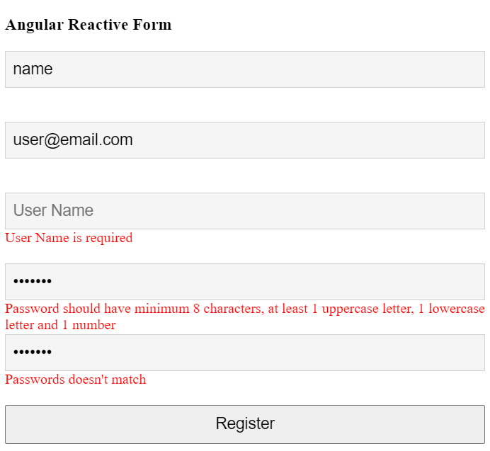

Handling user input with forms is the cornerstone of many common applications. Applications use forms to enable users to log in, to update a profile, to enter sensitive information, and to perform many other data-entry tasks.

Reactive forms are forms where we define the structure of the form in the component class. i.e. we create the form model with **Form Groups**, **Form Controls**, and **FormArrays**. We also define the validation rules in the component class. Then, we bind it to the HTML form in the template. This is different from the template-driven forms, where we define the logic and controls in the HTML template.

To use reactive form controls, import **ReactiveFormsModule** from the *@angular/forms* package and add it to NgModule's imports array.

```typescript
import { ReactiveFormsModule } from '@angular/forms';

@NgModule({
  imports: [
    // other imports ...
    ReactiveFormsModule
  ],
})
export class AppModule { }
```

In Angular, form controls are classes that can hold both the data values and the validation information of any form element. Every form input we have in a reactive form should be bound by a **FormControl**. These are the basic units that make up reactive forms.

## FormControl
**FormControl** is a class in Angular that tracks the value and validation status of an individual form control. One of the three essential building blocks in Angular forms — along with **FormGroup** and **FormArray** — **FormControl** extends the *AbstractControl* class, which enables it to access the value, validation status, user interactions, and events.

## FormGroup
**FormGroup** is used with **FormControl** to track the value and validate the state of form control. In practice, **FormGroup** aggregates the values of each child **FormControl** into a single object, using each control name as the key. It calculates its status by reducing the status values of its children so that if one control in a group is invalid, the entire group is rendered invalid.

## Example
Let's create a simple user registration form and implement some inbuilt validations on it. Along with the inbuilt validations, we will also implement some custom validations to the reactive form.

**app.component.html**
```html
<div class="container">
  <div class="row">
    <div class="col-md-8 mx-auto">
      <div class="card">
        <div class="card-header">
          <h3>Angular Reactive Form</h3>
        </div>
        <div class="card-body">
          <form class="form" [formGroup]="form" (ngSubmit)="onSubmit()">
            <div class="form-group">
              <input type="text"
                class="form-control"
                placeholder="Name"
                formControlName="name">
              <span class="text-danger"
                *ngIf="(form.get('name').touched || submitted) && form.get('name').errors?.required">
                Name is required
              </span>
            </div>
            <div class="form-group">
              <input type="text"
                class="form-control"
                placeholder="Email"
                formControlName="email">
              <span class="text-danger"
                *ngIf="(form.get('email').touched || submitted) && form.get('email').errors?.required">
                Email is required
              </span>
              <span class="text-danger"
                *ngIf="form.get('email').touched && form.get('email').errors?.email">
                Enter a valid email address
              </span>
            </div>
            <div class="form-group">
              <input type="text"
                class="form-control"
                placeholder="User Name"
                formControlName="username">
              <span class="text-danger"
                *ngIf="(form.get('username').touched || submitted) && form.get('username').errors?.required">
                User Name is required
              </span>
              <span class="text-danger"
                *ngIf="form.get('username').touched && form.get('username').errors?.userNameNotAvailable">
                User Name is not available
              </span>
            </div>
            <div class="form-group">
              <input type="password"
                class="form-control"
                placeholder="Password"
                formControlName="password">
              <span class="text-danger"
                *ngIf="(form.get('password').touched || submitted) && form.get('password').errors?.required">
                Password is required
              </span>
              <span class="text-danger"
                *ngIf="form.get('password').touched && form.get('password').errors?.invalidPassword">
                Password should have minimum 8 characters, at least 1 uppercase letter, 1 lowercase
                letter and 1 number
              </span>
            </div>
            <div class="form-group">
              <input type="password"
                class="form-control"
                placeholder="Confirm Password"
                formControlName="confirmPassword">
              <span class="text-danger"
                *ngIf="(form.get('confirmPassword').touched || submitted)&& form.get('confirmPassword').errors?.required">
                Confirm Password is required
              </span>
              <span class="text-danger"
                *ngIf="form.get('confirmPassword').touched && form.hasError('password-confirmation')">
                Passwords doesn't match
              </span>
            </div>
            <div class="form-group">
              <button type="submit" class="btn btn-success">Register</button>
            </div>
          </form>
        </div>
      </div>
    </div>
  </div>
</div>
```
**app.component.ts**

```typescript
import { Component, OnInit } from '@angular/core';
import { Validators, ValidatorFn,FormGroup, FormControl } from '@angular/forms';

@Component({
  selector: 'app-root',
  templateUrl: './app.component.html',
  styleUrls: ['./app.component.css']
})
export class AppComponent implements OnInit {
  submitted = false;
  form = new FormGroup({
    name: new FormControl('', Validators.required),
    email: new FormControl('', Validators.compose([Validators.required, Validators.email])),
    username: new FormControl('', Validators.required),
    password: new FormControl('', Validators.compose([Validators.required, this.patternValidator()])),
    confirmPassword: new FormControl('', Validators.required)
  }, this.matchPassword)

  onSubmit() {
    this.submitted = true;
    if (this.form.valid) {
      alert('Form Submitted succesfully!!!\n Check the values in browser console.');
      console.table(this.form.value);
    }
  }

  patternValidator(): ValidatorFn {
    return (control: FormControl): { [key: string]: any } => {
      if (!control.value) {
        return null;
      }
      const regex = new RegExp('^(?=.*?[A-Z])(?=.*?[a-z])(?=.*?[0-9]).{8,}$');
      const valid = regex.test(control.value);
      return valid ? null : { invalidPassword: true };
    };
  }

  matchPassword(control: FormGroup) {
    const password = control.get('password');
    const confirmation = control.get('confirmPassword');
    if (!password || !confirmation || password.value === confirmation.value) {
      return null;
    }
    return { 'password-confirmation': true };
  }  
}
```
